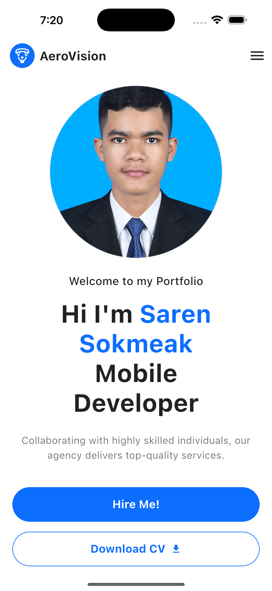

# AeroVision Portfolio

**Flutter | License**

Welcome to **AeroVision Portfolio**, a modern and responsive portfolio app built with Flutter. This project showcases the skills and work of **Saren Sokmeak**, a Mobile Developer, with a clean and elegant design.

## Features

- **Modern UI**: Clean and professional design with a focus on user experience.
- **Responsive Layout**: Works seamlessly on mobile, tablet, and desktop screens.
- **Interactive Buttons**:
  - **Hire Me!**: A call-to-action button to contact the designer.
  - **Download CV**: Allows users to download the designer's resume.
- **Navigation Bar**:
  - Logo on the left.

## Screenshots

| Home Screen |
|-------------|
|  |


## Installation

Follow these steps to set up and run the project on your local machine.

### Prerequisites

- **Flutter SDK**: Make sure you have Flutter installed. If not, follow the [official installation guide](https://flutter.dev/docs/get-started/install).
- **IDE**: Use Android Studio or VS Code with the Flutter and Dart plugins installed.

### Steps

#### Clone the Repository:
```bash
git clone https://github.com/Sokmeak/Mobile-Development.git
cd Mobile-Development
git checkout myportfolio
```

#### Install Dependencies:
```bash
flutter pub get
```

#### Run the App:
```bash
flutter run
```

#### Build the App (Optional):

For Android:
```bash
flutter build apk
```

For iOS:
```bash
flutter build ios
```

## Project Structure
```
lib/
├── main.dart                # Entry point of the application
├── widgets/
│   ├── profile_image.dart   # Profile image widget
│   ├── welcome_text.dart    # Welcome text widget
│   ├── name_text.dart       # Name and title widget
│   ├── description_text.dart# Description text widget
│   ├── hire_me_button.dart  # Hire Me button widget
│   ├── download_cv_button.dart # Download CV button widget
│   └── footer.dart          # Footer widget
assets/
├── images/                  # Contains all images (e.g., logo, profile picture)
```

## Customization

You can easily customize this project to fit your needs:

- **Change Logo**: Replace `assets/images/logo.png` with your logo.
- **Update Profile Image**: Replace `assets/images/profile.jpg` with your profile picture.
- **Modify Text**: Update the text in the `widgets/` files (e.g., `name_text.dart`, `description_text.dart`).
- **Add/Remove Menu Items**: Edit the `Row` widget in the `AppBar` to add or remove menu options.
- **Change Colors**: Update the `primarySwatch` in the `ThemeData` (in `main.dart`) to change the app's primary color.

## Dependencies

This project uses the following dependencies:

- **Flutter SDK**: For building the app.
- **Material Design**: For UI components.

No additional third-party packages are used to keep the project lightweight.

## Contributing

Contributions are welcome! If you find any issues or want to add new features, feel free to open a pull request.

1. **Fork** the repository.
2. **Create a new branch**:
   ```bash
   git checkout -b feature/YourFeatureName
   ```
3. **Commit your changes**:
   ```bash
   git commit -m 'Add some feature'
   ```
4. **Push to the branch**:
   ```bash
   git push origin feature/YourFeatureName
   ```
5. **Open a pull request**.

## License

This project is licensed under the **MIT License**. See the `LICENSE` file for details.

## Acknowledgements

- **Flutter**: For providing an amazing framework to build beautiful apps.
- **Material Design**: For the design inspiration and components.

## Contact

If you have any questions or feedback, feel free to reach out:

- **Email**:sarroussokmeak721@gmail.com
- **LinkedIn**: [My LinkedIn Profile](https://www.linkedin.com/in/sokmeak-saren-940a3123a/)  
- **Portfolio**: [My Portfolio](https://sokmeak.github.io/myportfolio/)

