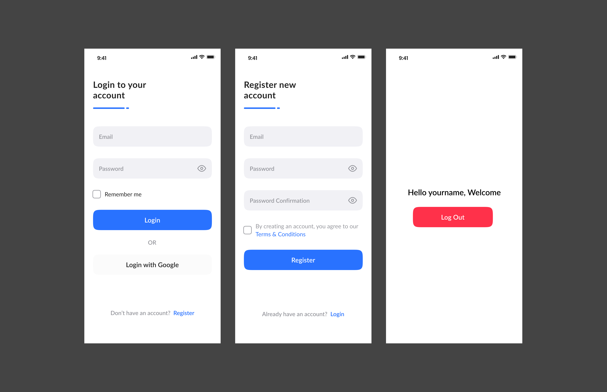

# Coinpro Login UI

A modern and clean Flutter application that implements a secure authentication flow for the Coinpro cryptocurrency platform. This project showcases a professionally designed login and registration UI with smooth navigation and user-friendly form validation.



## Features

- **Sleek Login Screen**
  - Email and password authentication
  - Password visibility toggle
  - "Remember Me" functionality
  - Google sign-in option
  - Form validation

- **Comprehensive Registration Flow**
  - Email, password, and confirmation fields
  - Password strength validation
  - Terms & Conditions agreement
  - Intuitive error handling

- **Modern UI/UX**
  - Clean, minimalist design
  - Responsive layout for various screen sizes
  - Smooth transitions between screens
  - Consistent branding with Coinpro's visual identity
  - Lato font family for optimal readability

- **Additional Features**
  - Welcome screen with user greeting
  - Secure logout functionality
  - Persistent session management

## Getting Started

### Prerequisites

- Flutter SDK (version 3.0.0 or higher)
- Dart SDK (version 2.17.0 or higher)
- Android Studio / VS Code with Flutter extensions
- An emulator or physical device for testing

### Installation

1. Clone this repository:
   ```bash
   git clone https://github.com/yourusername/coinpro-login-ui.git
2. Switct branch to authentication branch
   ``` bash 
   git checkout authentication
